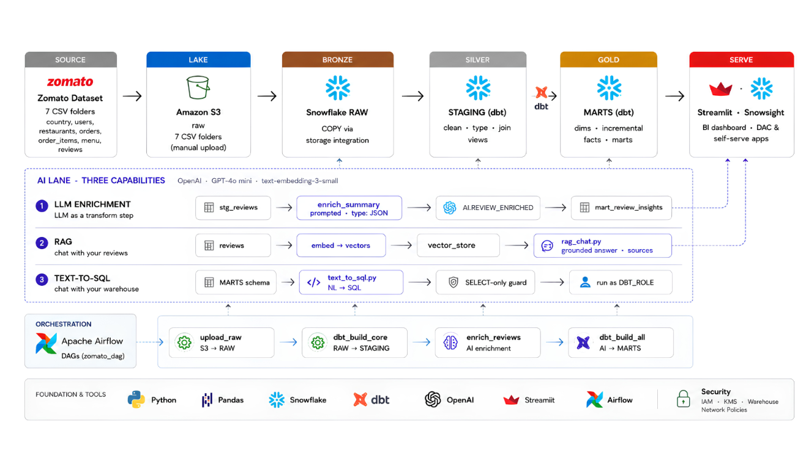

# 🚀 Zomato End-to-End Data Engineering & AI Platform

An end-to-end data engineering and AI analytics platform that takes Zomato-style food delivery data from raw CSV files to a cloud data warehouse and finally exposes analytics and AI-powered applications.

## 🔄 End-to-End Pipeline

**Zomato Dataset → Amazon S3 → Snowflake → dbt → Airflow → AI → Streamlit**

---

## 🏗️ Architecture



The platform follows a medallion-style data architecture:

```text
                    ZOMATO DATA PLATFORM

Zomato Dataset
      │
      ▼
 Amazon S3
  Data Lake
      │
      ▼
Snowflake RAW
 Bronze Layer
      │
      ▼
 dbt STAGING
 Silver Layer
      │
      ▼
  dbt MARTS
  Gold Layer
      │
      ▼
Streamlit / SnowSight
 Analytics & AI Apps
```

Alongside the core data pipeline, an AI lane provides three capabilities:

```text
                         AI LANE
                            │
            ┌───────────────┼───────────────┐
            │               │               │
            ▼               ▼               ▼
     LLM Enrichment        RAG        Text-to-SQL
            │               │               │
            ▼               ▼               ▼
    Review Insights    Review Chat    Warehouse Chat
```

---

# 🚀 Project Overview

This project demonstrates a complete batch data engineering pipeline for Zomato-style food delivery data.

The source data consists of seven datasets:

- Restaurants
- Users
- Food
- Menu
- Orders
- Order Items
- Reviews

The dataset contains approximately:

- **10 million orders**
- **23 million order items**
- **300,000 reviews**

The data is stored in Amazon S3, loaded into Snowflake using a storage integration, transformed using dbt, orchestrated using Apache Airflow, and finally exposed through analytics and AI applications.

---

# 📊 Project at a Glance

| Component | Details |
|---|---|
| Source Data | 7 CSV datasets |
| Orders | 10M |
| Order Items | ~23M |
| Reviews | 300K |
| Dataset Size | ~2.3 GB |
| Data Lake | Amazon S3 |
| Data Warehouse | Snowflake |
| Transformation | dbt |
| Orchestration | Apache Airflow |
| AI | OpenAI |
| Application | Streamlit |
| Containerization | Docker |
| Version Control | Git/GitHub |

---

# 🧱 Data Architecture

## 1. Source Layer

The source consists of seven CSV datasets:

```text
restaurants
users
food
menu
orders
order_items
reviews
```

These files represent the raw Zomato-style food delivery data.

---

# ☁️ 2. Data Lake — Amazon S3

The raw CSV files are uploaded to Amazon S3 using a folder structure:

```text
s3://<BUCKET>/raw/
│
├── restaurants/
├── users/
├── food/
├── menu/
├── orders/
├── order_items/
└── reviews/
```

Amazon S3 acts as the raw data lake before the data is loaded into Snowflake.

---

# ❄️ 3. Bronze Layer — Snowflake RAW

Snowflake loads the raw files from S3 using:

- Storage Integration
- External Stage
- CSV File Format
- `COPY INTO`

The raw data is stored inside:

```text
ZOMATO.RAW
```

The Bronze layer preserves the source data before transformation.

### Data Loading Flow

```text
Amazon S3
    │
    ▼
External Stage
    │
    ▼
COPY INTO
    │
    ▼
ZOMATO.RAW
```

---

# 🥈 4. Silver Layer — dbt STAGING

dbt transforms the RAW data into clean staging models.

Schema:

```text
ZOMATO.STAGING
```

Typical transformations include:

- Data type conversion
- Column renaming
- Null handling
- Data cleaning
- Standardization
- Derived columns
- Source joins

Example transformations:

```text
-- → NULL
₹ 200 → 200
```

Business fields such as delivery status are also derived during staging.

### Silver Flow

```text
ZOMATO.RAW
     │
     ▼
   dbt
     │
     ▼
ZOMATO.STAGING
```

---

# 🥇 5. Gold Layer — dbt MARTS

The Gold layer contains analytics-ready models.

Schema:

```text
ZOMATO.MARTS
```

## Dimensions

```text
dim_restaurants
dim_customer
dim_food
dim_date
```

## Facts

```text
fct_orders
fact_order_items
```

The large fact tables use incremental processing and MERGE strategies so that new data can be processed without rebuilding the entire dataset.

## Business Marts

Examples include:

- Daily city revenue
- GMV
- Average Order Value
- Cancellation rate
- Restaurant performance
- Delivery SLA
- Review insights

---

# 🤖 AI Layer

The project contains three AI capabilities:

1. LLM Review Enrichment
2. RAG — Chat With Your Reviews
3. Text-to-SQL — Chat With Your Warehouse

---

# 🧠 1. LLM Review Enrichment

The LLM is used as a transformation step.

```text
stg_reviews
      │
      ▼
     LLM
      │
      ▼
Structured JSON
      │
      ▼
ZOMATO.AI.REVIEW_ENRICHED
      │
      ▼
mart_review_insights
```

Free-text reviews are converted into structured information such as:

- Sentiment
- Topic
- Review summary

This makes unstructured review data easier to query and analyze.

---

# 🔎 2. RAG — Chat With Your Reviews

The RAG system allows users to ask questions about customer reviews.

Architecture:

```text
Reviews
   │
   ▼
Embeddings
   │
   ▼
Vector Store
   │
   ▼
Similarity Retrieval
   │
   ▼
LLM
   │
   ▼
Grounded Answer + Sources
```

The system retrieves relevant reviews before generating an answer.

This allows the application to provide answers grounded in the actual review dataset.

### Example Questions

```text
What are customers complaining about most?
```

```text
What do customers like about this restaurant?
```

```text
What are the most common delivery-related complaints?
```

---

# 💬 3. Text-to-SQL — Chat With Your Warehouse

Users can ask questions about the warehouse using natural language.

Example:

```text
Which restaurants have the highest number of positive reviews?
```

The pipeline becomes:

```text
Natural Language
       │
       ▼
      LLM
       │
       ▼
Generated SQL
       │
       ▼
SELECT-only Guard
       │
       ▼
   Snowflake
       │
       ▼
     Result
```

The application validates generated SQL before execution.

The SQL execution uses a restricted warehouse role:

```text
DBT_ROLE
```

The goal is to prevent destructive SQL operations from being executed through the AI interface.

---

# 🔄 Apache Airflow Orchestration

Apache Airflow orchestrates the complete pipeline as a daily DAG.

The main workflow is:

```text
reload_raw
     │
     ▼
dbt_build_core
     │
     ▼
enrich_reviews
     │
     ▼
dbt_build_ai
```

## Task Responsibilities

| Task | Responsibility |
|---|---|
| `reload_raw` | Load data from S3 into Snowflake RAW |
| `dbt_build_core` | Run dbt transformations and tests |
| `enrich_reviews` | Perform AI review enrichment |
| `dbt_build_ai` | Build AI-related marts |

Airflow runs inside Docker.

---

# 🔄 Complete Pipeline Flow

```text
                    SOURCE
                      │
                      ▼
              Zomato CSV Files
                      │
                      ▼
                 Amazon S3
                      │
                      ▼
              Snowflake RAW
                Bronze Layer
                      │
                      ▼
                dbt STAGING
                 Silver Layer
                      │
                      ▼
                 dbt MARTS
                  Gold Layer
                      │
              ┌───────┴────────┐
              │                │
              ▼                ▼
        Analytics          AI Layer
                              │
                 ┌────────────┼────────────┐
                 ▼            ▼            ▼
             Enrichment      RAG      Text-to-SQL
                 │            │            │
                 └────────────┼────────────┘
                              ▼
                     Streamlit Apps
```

---

# 🧪 Data Quality & dbt Testing

The dbt project includes data quality tests such as:

- `unique`
- `not_null`
- `relationships`
- `accepted_values`
- Reconciliation tests

The main command is:

```bash
dbt build
```

This builds models and executes tests according to their dependency order.

---

# 🔐 Security

Credentials are not stored directly in source code.

Environment variables are used for sensitive configuration such as:

```text
SNOWFLAKE_ACCOUNT
SNOWFLAKE_USER
SNOWFLAKE_PASSWORD
SNOWFLAKE_WAREHOUSE
SNOWFLAKE_DATABASE
SNOWFLAKE_SCHEMA
OPENAI_API_KEY
```

The repository intentionally excludes:

- `.env`
- Large datasets
- Airflow logs
- Generated embedding files
- dbt build artifacts

The S3 → Snowflake connection uses a storage integration and IAM role rather than storing AWS access keys in the application.

---

# 🔑 S3 → Snowflake Security

Snowflake reads the S3 bucket using a storage integration and IAM role.

```text
Amazon S3
    │
    │ IAM Role
    ▼
Snowflake Storage Integration
    │
    ▼
External Stage
    │
    ▼
Snowflake RAW
```

This avoids storing AWS access keys directly inside the application.

---

# 🛠️ Tech Stack

| Technology | Purpose |
|---|---|
| Python | Data engineering & AI applications |
| Pandas | Data processing |
| Amazon S3 | Data lake |
| Snowflake | Cloud data warehouse |
| dbt | Data transformation & testing |
| Apache Airflow | Pipeline orchestration |
| OpenAI | LLM & embeddings |
| Streamlit | AI applications & dashboards |
| Docker | Airflow environment |
| Git/GitHub | Version control |

---

# 📂 Repository Structure

```text
zomato-end-to-end-data-engineering/
│
├── airflow/
│   ├── Dockerfile
│   ├── docker-compose.yaml
│   ├── example.env
│   └── dags/
│       └── zomato_batch.py
│
├── ai/
│   ├── enrich_reviews.py
│   ├── rag_chat.py
│   ├── text_to_sql.py
│   └── example.env
│
├── zomato/
│   ├── models/
│   │   ├── staging/
│   │   ├── marts/
│   │   └── example/
│   ├── macros/
│   ├── dbt_project.yml
│   └── README.md
│
├── docs/
│   └── architecture.png
│
├── .gitignore
└── README.md
```

---

# ⚙️ Setup

## 1. Clone the Repository

```bash
git clone https://github.com/Rishabh00b/zomato-end-to-end-data-engineering.git

cd zomato-end-to-end-data-engineering
```

---

## 2. Create Python Environment

### Windows

```powershell
python -m venv .venv
.venv\Scripts\Activate.ps1
```

### Linux/macOS

```bash
python3 -m venv .venv
source .venv/bin/activate
```

---

## 3. Install Dependencies

```bash
pip install -r requirements.txt
```

---

# ❗ Dataset

The complete dataset is intentionally not included in this repository because of its size.

The project uses approximately **2.3 GB of CSV data**.

The seven datasets are:

```text
restaurants
users
food
menu
orders
order_items
reviews
```

Place the downloaded data in the local data directory before running the pipeline.

---

# ❄️ Snowflake Setup

The Snowflake environment contains:

```text
ZOMATO
│
├── RAW
├── STAGING
├── MARTS
├── SNAPSHOTS
└── AI
```

The setup process includes:

```text
01_setup.sql
02_storage_integration.sql
03_stage_and_formats.sql
04_raw_tables.sql
05_copy_into.sql
```

Run these scripts in order when configuring the Snowflake environment.

---

# 🔧 dbt

Navigate to the dbt project:

```bash
cd zomato
```

Configure the Snowflake credentials through environment variables.

Run:

```bash
dbt debug
```

Build the core models:

```bash
dbt build --exclude tag:ai
```

---

# 🌬️ Airflow

Navigate to:

```bash
cd airflow
```

Create your environment file:

```bash
cp example.env .env
```

Configure the required Snowflake and AI credentials.

Build and start Airflow:

```bash
docker compose build
docker compose up -d
```

Open the Airflow UI locally.

Then enable and trigger:

```text
zomato_batch
```

---

# 🧠 AI Applications

## Review Enrichment

```bash
python ai/enrich_reviews.py
```

## RAG Review Chat

```bash
streamlit run ai/rag_chat.py
```

## Text-to-SQL

```bash
streamlit run ai/text_to_sql.py
```

---

# 📊 Business Questions Supported

The analytics layer can answer questions such as:

```text
Which cities generate the highest revenue?
```

```text
What is the average order value?
```

```text
Which restaurants perform best?
```

```text
What are the most common review topics?
```

```text
What are customers saying about a restaurant?
```

```text
Which restaurants receive the most positive reviews?
```

---

# 🎯 Engineering Concepts Demonstrated

This project demonstrates practical experience with:

- Data Lake architecture
- Data Warehouse architecture
- Medallion architecture
- ETL / ELT
- Cloud storage
- Snowflake
- dbt
- Incremental models
- MERGE strategies
- Dimensional modeling
- Fact and dimension tables
- SCD Type 2
- Data quality testing
- Apache Airflow
- Docker
- LLM integration
- Embeddings
- RAG
- Vector search
- Natural-language-to-SQL
- SQL safety
- Streamlit
- Cloud IAM
- Git/GitHub

---

# 📌 Key Data Engineering Features

## Incremental Processing

Large fact tables are processed incrementally rather than rebuilding the complete dataset.

```text
New Data
   │
   ▼
Incremental dbt Model
   │
   ▼
MERGE
   │
   ▼
Gold Fact Table
```

## Data Quality

The dbt project uses automated tests to validate transformed data.

```text
Source
  ↓
Transformation
  ↓
Data Quality Tests
  ↓
Analytics Models
```

## Orchestration

Airflow coordinates the complete pipeline:

```text
S3
 ↓
Snowflake RAW
 ↓
dbt
 ↓
AI Enrichment
 ↓
AI Marts
```

---

# 🔮 Future Improvements

Potential future improvements include:

- Automated data quality monitoring
- CI/CD for dbt and Airflow
- Better RAG retrieval
- Hybrid search
- AI evaluation framework
- Pipeline monitoring and alerting
- Streamlit cloud deployment
- Authentication
- Role-based access control
- Additional business dashboards

---

# 📚 Project Learning Outcomes

This project provides hands-on experience with a complete modern data platform.

The major areas covered are:

```text
Cloud Storage
      ↓
Data Lake
      ↓
Cloud Data Warehouse
      ↓
Data Transformation
      ↓
Data Modeling
      ↓
Data Quality
      ↓
Pipeline Orchestration
      ↓
AI Integration
      ↓
Analytics Applications
```

---

# 👨‍💻 Author

## Rishabh

**B.Tech CSE-AI**

Areas of interest:

- Data Engineering
- Cloud Computing
- AI/ML
- Backend Development
- Data Analytics

GitHub: https://github.com/Rishabh00b

---

# ⭐ Project

If you find this project useful, consider giving the repository a star.

---

## 📌 Note

The large source dataset, environment files, credentials, generated logs, and generated embedding files are intentionally excluded from the Git repository.

The repository contains the code, transformation logic, orchestration configuration, AI applications, SQL setup, and project documentation required to understand and reproduce the pipeline.
